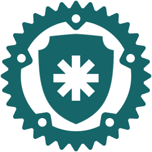

<a id="readme-top"></a>

[![Contributors][contributors-shield]][contributors-url]
[![Forks][forks-shield]][forks-url]
[![Stargazers][stars-shield]][stars-url]
[![Issues][issues-shield]][issues-url]
[![MIT License][license-shield]][license-url]
[![LinkedIn][linkedin-shield]][linkedin-url]

<br />
<div align="center">
  <a href="https://github.com/gabrielkim13/senhasegura-rs">
    
  </a>

  <h3 align="center">senhasegura-rs</h3>

  <p align="center">
    A Rust library for interacting with <a href="https://senhasegura.com/">senhasegura</a>'s API.
    <br />
    <a href="https://docs.rs/senhasegura-rs/latest/senhasegura-rs"><strong>Explore the docs »</strong></a>
    <br />
  </p>
</div>

<details>
  <summary>Table of Contents</summary>
  <ol>
    <li>
      <a href="#about-the-project">About The Project</a>
      <ul>
        <li><a href="#built-with">Built With</a></li>
      </ul>
    </li>
    <li>
      <a href="#getting-started">Getting Started</a>
      <ul>
        <li><a href="#prerequisites">Prerequisites</a></li>
        <li><a href="#installation">Installation</a></li>
      </ul>
    </li>
    <li><a href="#usage">Usage</a></li>
    <li><a href="#build">Build</a></li>
    <li><a href="#roadmap">Roadmap</a></li>
    <li><a href="#contributing">Contributing</a></li>
    <li><a href="#license">License</a></li>
    <li><a href="#contact">Contact</a></li>
    <li><a href="#acknowledgments">Acknowledgments</a></li>
  </ol>
</details>

## About The Project

A Rust library for interacting with [senhasegura](https://senhasegura.com)'s API.

The goal of this project is to enable interaction with senhasegura's APIs in many languages /
runtimes while maintaining a single core codebase (i.e. `senhasegura-rs`) and several other
libraries bound to it.

<p align="right">(<a href="#readme-top">back to top</a>)</p>

### Built With

* [![Rust][Rust]][Rust-url]

<p align="right">(<a href="#readme-top">back to top</a>)</p>

## Getting Started

### Prerequisites

* [Rust](https://www.rust-lang.org/learn/get-started)

#### Cross-compilation

In order to cross-compile to Windows MSVC target, install
[cargo-xwin](https://github.com/rust-cross/cargo-xwin):

```sh
# Clang
sudo apt install clang

# For assembly dependencies, which is the case
rustup component add llvm-tools-preview

# cargo-xwin
cargo install --locked cargo-xwin

# Windows x64 MSVC target
rustup target add x86_64-pc-windows-msvc
```

#### cbindgen

This project uses [cbindgen](https://github.com/mozilla/cbindgen/blob/master/docs.md) to generate
the C header file with the FFI of the library.

To install it, run:

```sh
cargo install --force cbindgen
```

#### NAPI-RS

This project uses [NAPI-RS](https://napi.rs/) to generate JS bindings, adding first-class support
for [Node.js](https://nodejs.org/).

In order to work on the [senhasegura-js](./senhasegura-js/) library project, an installation of
Node.js is required.

To support Linux systems with an older glibc version, use [Zig](https://ziglang.org/) to compile the
library under a specific ABI version:

```sh
yarn build --zig --zig-abi-prefix=2.28
```

#### UniFFI

This project uses [UniFFI](https://mozilla.github.io/uniffi-rs/latest/) to generate bindings for
multiple languages, such as [Python](https://www.python.org/),
[C#](https://dotnet.microsoft.com/languages/csharp), [Go](https://go.dev/) and
[C++](https://cppreference.com).

UniFFI supports generating Python bindings out of the box and nothing else is required to generate
its bindings. However, C++, C# and Go bindings require installing third-party _bindgen_ tooling:

- [uniffi-bindgen-cpp](https://github.com/NordSecurity/uniffi-bindgen-cpp)
- [uniffi-bindgen-cs](https://github.com/NordSecurity/uniffi-bindgen-cs)
- [uniffi-bindgen-go](https://github.com/NordSecurity/uniffi-bindgen-go)

### Installation

> Pending installation instructions for Python, C#, Go and C++...

#### Rust

```toml
[dependencies]
senhasegura-rs = "0.3"
```

#### C

See [senhasegura-c](senhasegura-c/README.md).

#### Node.js

See [senhasegura-js](senhasegura-js/README.md).

<p align="right">(<a href="#readme-top">back to top</a>)</p>

## Usage

> Pending examples for Python, C#, Go and C++...

### Rust

```rs
use senhasegura_rs::{AccessProtectedInformationAPI, SenhaseguraClient};

let base_url = "https://senhasegura.acme.com".parse()?;
let client_id = "client_id";
let client_secret = "client_secret";

let client = SenhaseguraClient::builder(base_url, client_id, client_secret).build()?;

// Access protected information
println!("{:#?}", client.access_protected_information(28)?);
```

### C

See [senhasegura-c](senhasegura-c/README.md).

### Node.js

See [senhasegura-js](senhasegura-js/README.md).

_For more examples, please refer to the [Documentation](https://docs.rs/senhasegura-rs/latest/senhasegura-rs)_

<p align="right">(<a href="#readme-top">back to top</a>)</p>

## Build

### [cbindgen](https://github.com/mozilla/cbindgen)

The build process for the C header file with the FFI of the library is automated by `cbindgen`'s
CLI:

```sh
cbindgen \
    --config senhasegura-c/cbindgen.toml \
    --crate senhasegura-c \
    --output bindings/senhasegura_c.h
```

### [NAPI-RS](https://napi.rs/)

The build process for the JS bindings of the library is automated by `napi`'s CLI:

```sh
cd senhasegura-js
yarn build
```

The generated bindings and binaries (i.e. `*.node` files) are kept at the root of the
[senhasegura-js](./senhasegura-js/) folder, but are ignored by Git.

### [UniFFI](https://mozilla.github.io/uniffi-rs/latest/)

> These instructions will be automated in the future, and are documented here until then.

1. Generate a _debug_ build of `senhasegura-rs`, while enabling the `uniffi` feature:

   > This is necessary for keeping the UniFFI metadata present in the binary itself.

   ```sh
   cargo build -p senhasegura-rs --features uniffi
   ```

2. Generate Python bindings:

   ```sh
   cargo run
     -p senhasegura-rs \
     --features=uniffi/cli \
     --bin uniffi-bindgen \
       generate \
       --library target/debug/libsenhasegura_rs.so \
       -l python \
       --out-dir bindings \
       --no-format
   ```

3. Generate C++ bindings:

   ```sh
   uniffi-bindgen-cpp --library target/debug/libsenhasegura_rs.so --out-dir bindings
   ```

4. Generate C# bindings:

   ```sh
   uniffi-bindgen-cs --library target/debug/libsenhasegura_rs.so --out-dir bindings
   ```

5. Generate Go bindings:

   ```sh
   uniffi-bindgen-go --library target/debug/libsenhasegura_rs.so --out-dir bindings
   ```

6. Generate the Linux / Windows x64 _release_ binaries and copy them into the :

   ```sh
   # Linux x64 (native)
   cargo build -p senhasegura-rs --features uniffi --release

   # Windows x64 MSVC
   cargo xwin build -p senhasegura-rs --features uniffi --release --target x86_64-pc-windows-msvc

   # Copy libraries
   cp \
     target/release/libsenhasegura_rs.so \
     target/x86_64-pc-windows-msvc/release/senhasegura_rs.dll \
     bindings
   ```

All generated bindings are kept in the [bindings](./bindings/) folder, but are ignored by Git.

<p align="right">(<a href="#readme-top">back to top</a>)</p>

## Roadmap

### Senhasegura APIs

- [PAM Core APIs](https://docs.senhasegura.io/docs/a2a-apis-pam-core)
  - [ ] [Credentials API](https://docs.senhasegura.io/docs/a2a-pam-core-credentials-api)
  - [ ] [Devices API](https://docs.senhasegura.io/docs/a2a-pam-core-devices-api)
  - [ ] [Proxy API](https://docs.senhasegura.io/docs/a2a-proxy-api)
  - [ ] [SSH Keys API](https://docs.senhasegura.io/docs/a2a-pam-core-ssh-keys-api)
  - [x] [Protected information API](https://docs.senhasegura.io/docs/en/a2a-pam-core-protected-information-api)
- [ ] [Related users API](https://docs.senhasegura.io/docs/a2a-pam-core-related-users-api)

### Languages

- [x] [C](https://en.wikipedia.org/wiki/C_(programming_language))
      ([cbindgen](https://github.com/mozilla/cbindgen))
- [x] [C++](https://cppreference.com)
      ([uniffi-bindgen-cpp](https://github.com/NordSecurity/uniffi-bindgen-cpp))
- [x] [C#](https://dotnet.microsoft.com/languages/csharp)
      ([uniffi-bindgen-cs](https://github.com/NordSecurity/uniffi-bindgen-cs))
- [x] [Go](https://go.dev/)
      ([uniffi-bindgen-go](https://github.com/NordSecurity/uniffi-bindgen-go))
- [x] [Node.js](https://nodejs.org/)
      ([NAPI-RS](https://napi.rs/))
- [ ] [PHP](https://www.php.net/)
- [x] [Python](https://www.python.org/)
      ([UniFFI](https://mozilla.github.io/uniffi-rs/latest/))
- [x] [Rust](https://www.rust-lang.org/)

See the [open issues](https://github.com/gabrielkim13/senhasegura-rs/issues) for a full list of proposed features (and known issues).

<p align="right">(<a href="#readme-top">back to top</a>)</p>

## Contributing

Contributions are what make the open source community such an amazing place to learn, inspire, and create. Any contributions you make are **greatly appreciated**.

If you have a suggestion that would make this better, please fork the repo and create a pull request. You can also simply open an issue with the tag "enhancement".
Don't forget to give the project a star! Thanks again!

1. Fork the Project
2. Create your Feature Branch (`git checkout -b feature/AmazingFeature`)
3. Commit your Changes (`git commit -m 'Add some AmazingFeature'`)
4. Push to the Branch (`git push origin feature/AmazingFeature`)
5. Open a Pull Request

<p align="right">(<a href="#readme-top">back to top</a>)</p>

## License

Distributed under the MIT License. See `LICENSE` for more information.

<p align="right">(<a href="#readme-top">back to top</a>)</p>

## Contact

Gabriel Kim - [gabrielkim13](https://github.com/gabrielkim13) - gabrielkim13@gmail.com

Project Link: [https://github.com/gabrielkim13/senhasegura-rs](https://github.com/gabrielkim13/senhasegura-rs)

<p align="right">(<a href="#readme-top">back to top</a>)</p>

## Acknowledgments

* [cbindgen](https://github.com/mozilla/cbindgen)
* [NAPI-RS](https://napi.rs/)
* [UniFFI](https://mozilla.github.io/uniffi-rs/latest/)

<p align="right">(<a href="#readme-top">back to top</a>)</p>

[contributors-shield]: https://img.shields.io/github/contributors/gabrielkim13/senhasegura-rs.svg?style=for-the-badge
[contributors-url]: https://github.com/gabrielkim13/senhasegura-rs/graphs/contributors
[forks-shield]: https://img.shields.io/github/forks/gabrielkim13/senhasegura-rs.svg?style=for-the-badge
[forks-url]: https://github.com/gabrielkim13/senhasegura-rs/network/members
[stars-shield]: https://img.shields.io/github/stars/gabrielkim13/senhasegura-rs.svg?style=for-the-badge
[stars-url]: https://github.com/gabrielkim13/senhasegura-rs/stargazers
[issues-shield]: https://img.shields.io/github/issues/gabrielkim13/senhasegura-rs.svg?style=for-the-badge
[issues-url]: https://github.com/gabrielkim13/senhasegura-rs/issues
[license-shield]: https://img.shields.io/github/license/gabrielkim13/senhasegura-rs.svg?style=for-the-badge
[license-url]: https://github.com/gabrielkim13/senhasegura-rs/blob/master/LICENSE
[linkedin-shield]: https://img.shields.io/badge/-LinkedIn-black.svg?style=for-the-badge&logo=linkedin&colorB=555
[linkedin-url]: https://linkedin.com/in/gabrielkimrocha
[Rust]: https://img.shields.io/badge/Rust-CE412B?style=for-the-badge&logo=rust&logoColor=black
[Rust-url]: https://www.rust-lang.org/
